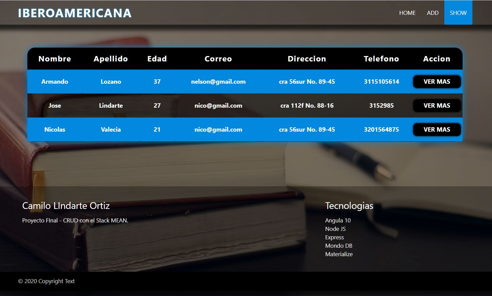
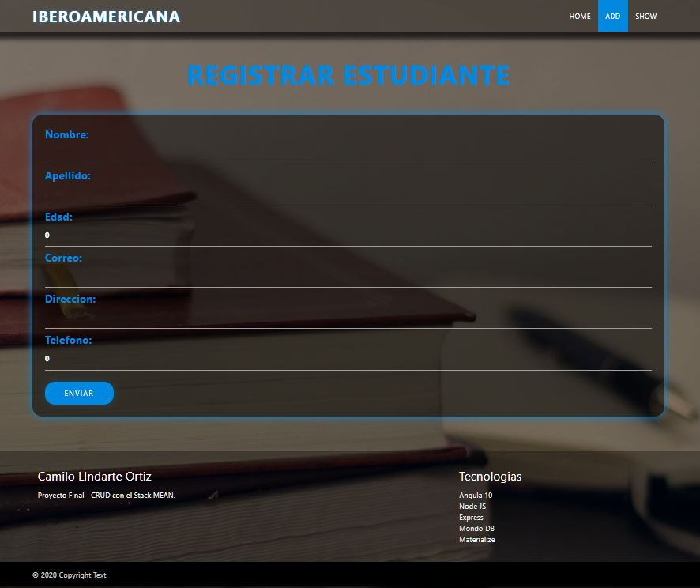
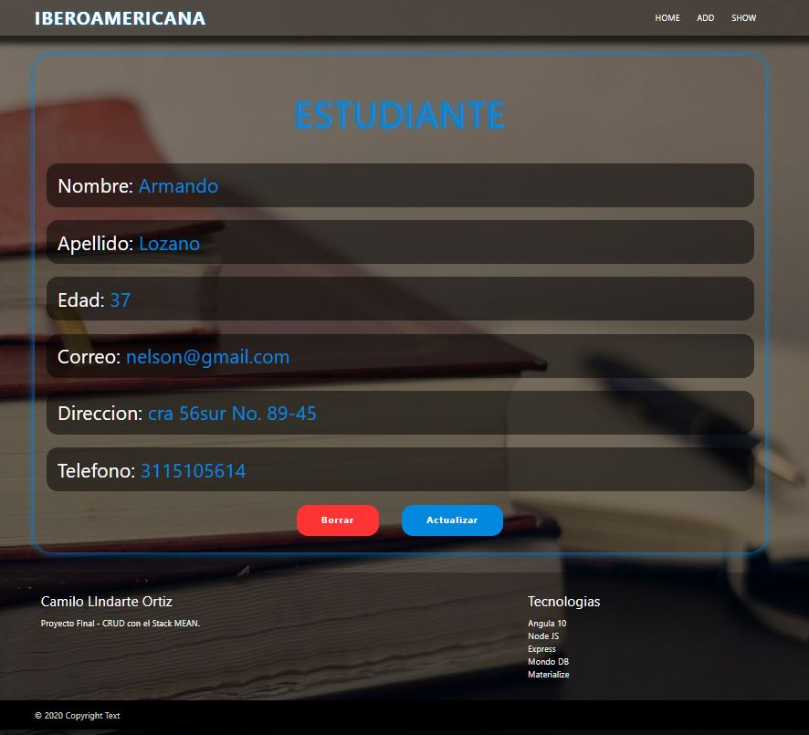
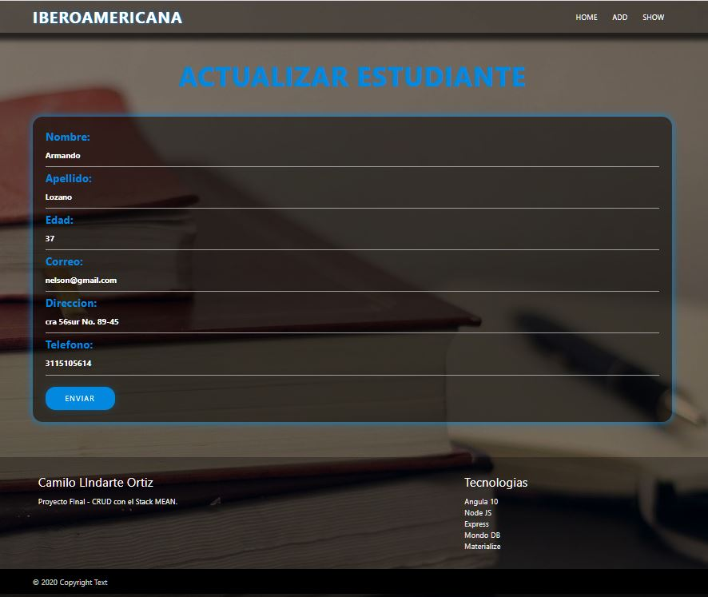

<h1>CONTROL DE ESTUDIANTES</h1>

    Esta es una app que permite gestionar estudiantes y funcionarios de un colegio o instituto educativo. Con este desarrollo podras crear, listar, elimanar o actualizar cualquier registro de la base de datos. 

<h1>HOMEPAGE</h1>

    </img>

<h1>LISTADO DE ESTUIANTES</h1>

    </img>

<h1>AGREGAR ESTUDIANTE</h1>

    </img>

<h1>DETALLE DE ESTUDIANTE</h1>

    </img>

<h1>ACTUALIZAR RESGISTRO</h1>

    </img>

    <h1>COMO CORRER EL PROYECTO?</h1>
    <ol>
        <li>Crea una base de datos en MongoDB. En este ejemplo le pondremos "eduBIT". Se crea con el siguiente comando: use eduBit</li>
        <li>Correr los servers</li>
        <li>Abrir dos consolas</li>
        <li>En una consola posicionate en la carpeta server y ejecuta el comando npm start</li>
        <li>En la otra consola, posicionate en la carpeta frontend y ejecuta el comando ng serve --open</li>
    </ol>

    <h1>TECNOLOGIAS USADAS</h1>
    <ol>
        <li>Angular 10</li>
        <li>CSS3</li>
        <li>Bootstrap</li>
        <li>Nodejs</li>
        <li>Expresjs</li>
        <li>MongoDB</li>
    </ol>

